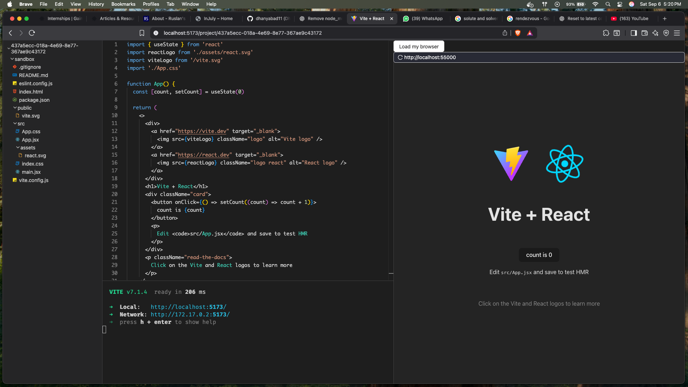

# CodeSandBox



CodeSandBox is a full-stack browser-based IDE and development environment. It features a Node.js backend for containerized project management and a React/Vite frontend with Monaco Editor, integrated terminal, and file explorer.

---

## Features

-   **Project Management:** Create, edit, and delete coding projects in isolated containers.
-   **Real-time Collaboration:** Edit files and share terminals live with Socket.IO.
-   **Integrated Terminal:** Access a bash shell in your browser, powered by Docker and xterm.js.
-   **Monaco Editor:** Syntax highlighting, auto-complete, and theming for multiple languages.
-   **File Explorer:** Tree view, context menus, and drag-and-drop file operations.
-   **Live Preview:** Instantly view your running React/Vite apps in-browser.

---

## Tech Stack

**Backend:** Node.js, Express, Socket.IO, Docker, Chokidar

**Frontend:** React 18, Vite, Monaco Editor, Zustand, xterm.js, Ant Design

---

## Project Structure

```
CodeSandBox/
├── backend/
│   ├── src/
│   │   ├── config/
│   │   ├── controllers/
│   │   ├── routes/
│   │   ├── service/
│   │   ├── socketHandlers/
│   │   ├── containers/
│   │   ├── utils/
│   │   ├── index.js
│   │   └── terminalApp.js
│   ├── projects/
│   ├── Dockerfile
│   └── package.json
├── frontend/
│   ├── src/
│   │   ├── components/
│   │   ├── pages/
│   │   ├── store/
│   │   ├── hooks/
│   │   ├── apis/
│   │   ├── utils/
│   │   └── config/
│   ├── public/
│   ├── package.json
│   └── vite.config.js
└── README.md
```

---

## Backend Setup

```bash
cd backend
npm install
docker build -t sandbox .
npm run dev # or npm start
```

**Environment Variables:**
Create a `.env` file in `backend/`:

```
PORT=3000
REACT_PROJECT_COMMAND=npm create vite@latest sandbox -- --template react
```

---

## Frontend Setup

```bash
cd frontend
npm install
npm run dev
```

**Environment Variables:**
Create `.env.local` in `frontend/`:

```
VITE_BACKEND_URL=http://localhost:3000
```

---

## Quick Start

1. Start backend (`backend/`):
    - `npm install && docker build -t sandbox . && npm run dev`
2. Start frontend (`frontend/`):
    - `npm install && npm run dev`
3. Open [http://localhost:5173](http://localhost:5173)

---

## Example API Usage

Create a new project (frontend):

```js
const response = await fetch("http://localhost:3000/api/v1/projects", { method: "POST" });
const { projectId } = await response.json();
```

Connect to editor socket:

```js
import { io } from "socket.io-client";
const editorSocket = io("http://localhost:3000/editor", { query: { projectId } });
```

---

## Contribution

1. Fork the repository
2. Create a feature branch
3. Commit and push your changes
4. Open a pull request

---

## License

MIT
